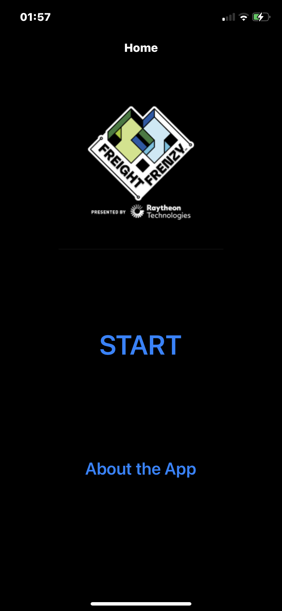
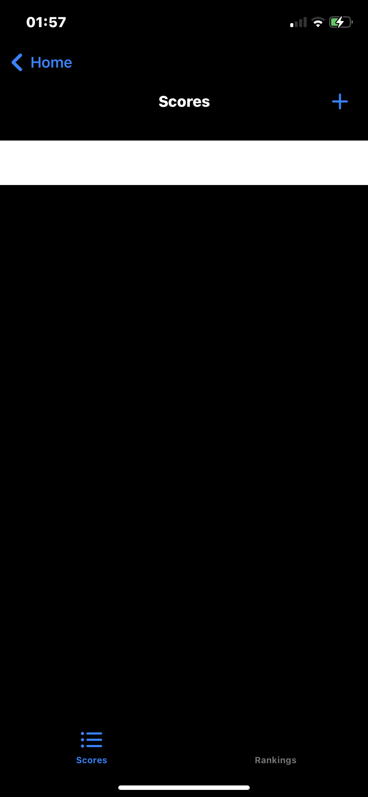
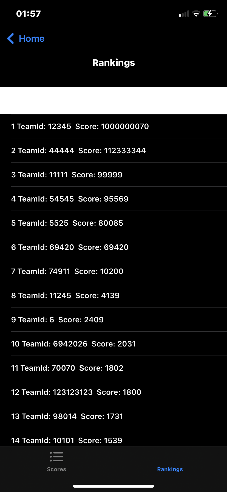
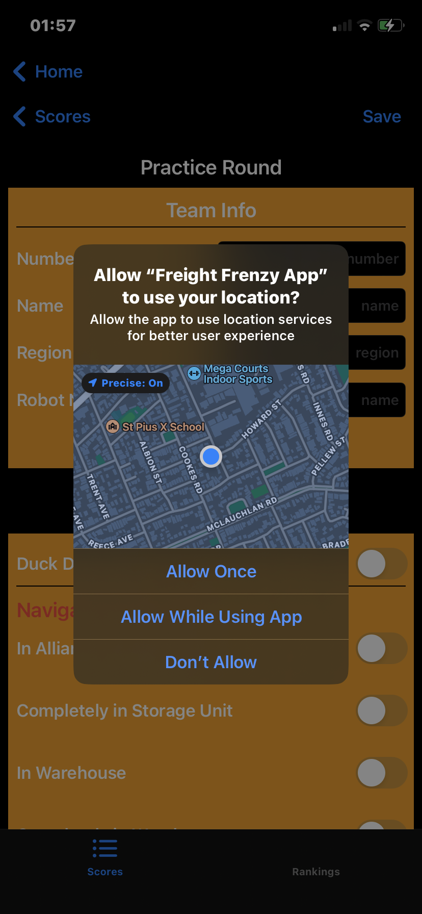
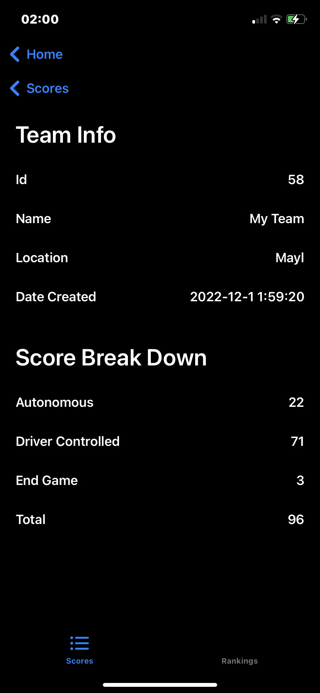

# Freigh-Frenzy-Mobile-App
<<<<<<< HEAD
A scoring app for the freight frenzy competitions.
=======
A scoring app for the freight frenzy competitions. Allowing users to upload their scores online and also view score rankings.

The app was developed using the Swift programming language. Sending and receiving ranking scores was implemented using json api requests.

## App preview

<!-- asdasdasdasd	|	dasdasdasdasda	
:--------------:|:--------------: -->
		

	

>>>>>>> 0ca97ed (Initial commit)
